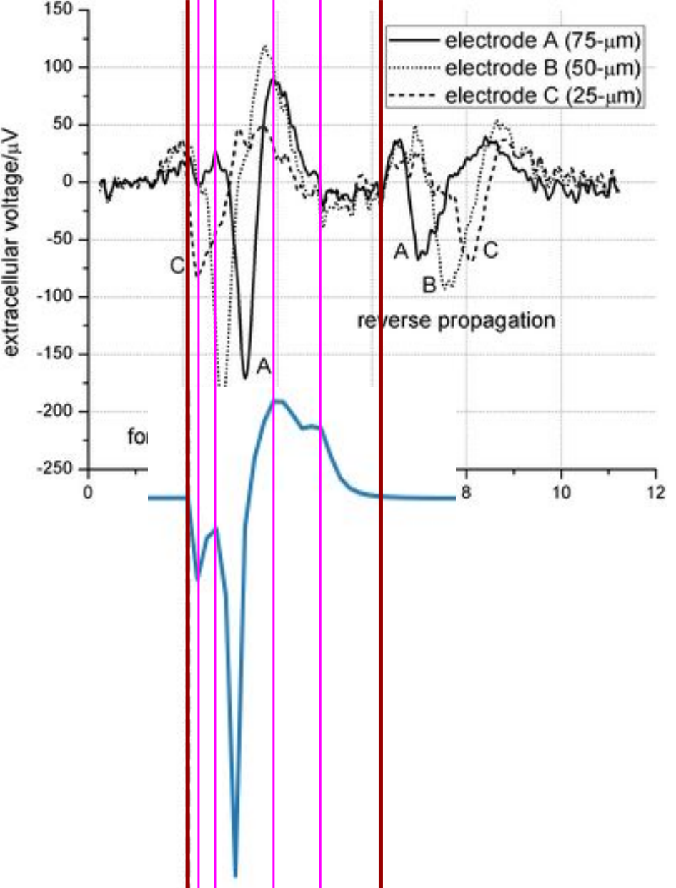

### The Neural Simulation Tool - NEST with NcN lab changes
### Cloned from original repository [nest-simulator](https://github.com/nest/nest-simulator)

-------------

[(Harilal P, 2016)]: https://www.frontiersin.org/articles/10.3389/fncom.2016.00065/full
[(Bradley J, 2009)]: https://pubs.rsc.org/en/content/articlehtml/2009/lc/b806689bhttps://pubs.rsc.org/en/content/articlehtml/2009/lc/b806689b

Changes:

#### 1. Extracellular recording from hh_cond_exp_traub neuron model

##### Theoretical material
The theoretical information was taken from article [(Harilal P, 2016)] *Computational Modeling of Single Neuron Extracellular Electric Potentials and Network Local Field Potentials using LFPsim* 
>With NEURON, the transmembrane ionic currents in multi-compartmental models can be calculated by summing up all active currents estimated using extracellular mechanism from NEURON as implemented in LFPsim


```python
I_transmemberane = I_ionic + C_m * ∂V_m / ∂t
```
> Where, I_ionic represent the ionic currents and C_m * ∂V_m / ∂t represent the capacitive current.

##### NEST realisation
The formula was extended for NEST hh_cond_exp_traub neuron model
```python
EC = I_Na + I_K + I_L + I_syn_exc + I_syn_inh + C_m * node.P_.delta_Vm / Time::get_resolution().get_ms()
```
Where (pseudo-code):
```python
node.P_.delta_Vm = V_m[n] - V_m[n-1]
```

##### Results
The NEST results was compared with results of [(Bradley J, 2009)]



#### 2. Pre-synaptic inhibition

##### Theoretical material
##### NEST realisation
##### Results
